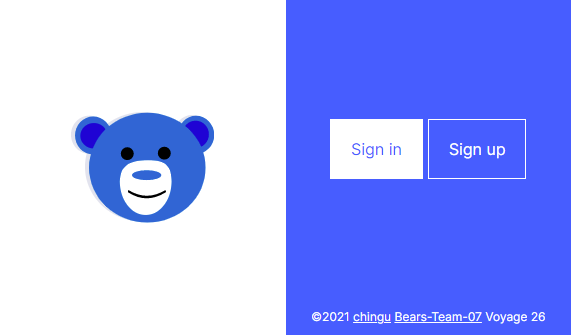

## [**🎼 Bear Class**](https://bearclass.netlify.app/)

Voyage-26 | [chingu.io](https://chingu.io) | [Twitter](https://twitter.com/ChinguCollabs)

### We created a Google Classroom clone with the purpose of streamlining the process surrounding music teaching.

<a href="https://bearclass.netlify.app/" target="_blank">
  

    
  

</a>

**[See it live!](https://bearclass.netlify.app/)**

## How Do I Deploy?

You'll need a Netlify and Fauna account.

1. Clone the repo and [deploy with Netlify](https://docs.netlify.com/site-deploys/create-deploys/#deploy-with-git)
2. Create a database in FaunaDB. 
3. In the DB's dashboard...
    - GraphQL tab
        - Upload schema from the repo's `api/schema.gql`
    - Security tab
        - ROLES tab: Create a new role of `user` and use the `User` collection for membership. Give it access to all Collections & Indexes privileges (or as you see fit for fine-grained privileges).
        - KEYS tab: Create a new server role key and add it to your Netlify [environment variables](https://docs.netlify.com/configure-builds/environment-variables/#declare-variables) as `FAUNA_KEY`

## The 🐻 **Team & Testimonials**

**[Fang🦁](https://github.com/armchair-traveller)**

[**Olajide Olaniyan**](https://github.com/jidemobell)

[**Tim Leonard**](https://github.com/iamtimleonard)

## Objectives

Main: We used this project as an opportunity to take a deep dive into the world of Svelte with great success.

- [x]  Sign up/in/out
- [x]  Create & join class
- [x]  View people in class
- [x]  Announcements & comments
- [x]  Create assignments
- [x]  Calendar
- [ ]  Submissions
- [ ]  Settings
- [ ]  Categories
- [ ]  Archived Classes
- [ ]  Review
- [ ]  Grades

## **Tech**

**Frontend**

[Svelte](https://svelte.dev/)

[Routify](https://routify.dev/)

[urql](https://formidable.com/open-source/urql/)

**Database** [Fauna](https://fauna.com/) ([GraphQL](https://graphql.org/) frontend & FQL + serverless functions)

**Platform** [Netlify](https://www.netlify.com/)

**Architecture** [Jamstack](https://jamstack.org/) ([Serverless](https://serverless.css-tricks.com/), so hot right now 🌶. Serverless)

**Dates** [Day.js](https://day.js.org/)

**Project Management** [Notion](https://www.notion.so/)
